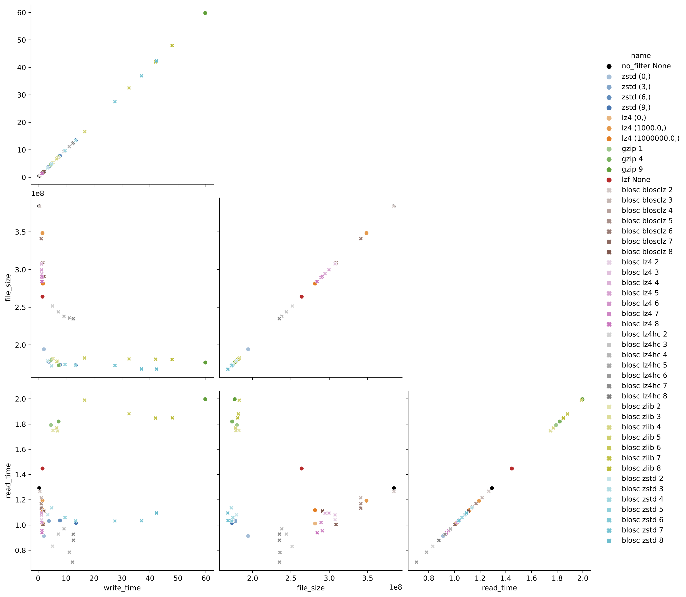

When submitting large datasets to the DANDI Archive, it's crucial to consider data compression options that can substantially reduce file sizes. Smaller files reduce the storage burden on the DANDI Archive and make datasets more convenient to download for users. Neurodata Without Borders (NWB) now supports two file format backends: HDF5 and Zarr. Both formats have built-in capabilities for chunking and compression that can break large datasets into smaller pieces and apply lossless compression to each chunk. This approach reduces file size without altering the dataset values.

DANDI recommends compressing large datasets, but the variety of algorithms and settings available can be overwhelming for NWB users unfamiliar with data engineering. This post aims to answer several common questions:

- By how much can the volume of my data be reduced?
- What compression options are available and how can I access them?
- Which compression algorithms and settings are optimal for my use case?

The answers depend on specific use cases, but our analysis provides general guidelines to help you make informed decisions based on three key metrics: file size, read speed, and write speed. You may also need to consider accessibility - whether the HDF5 or Zarr library can read your file out of the box or requires installation of a dynamic filter.

When considering a compression algorithm, you should consider the following trade-offs:
- **File Size**: Higher compression levels typically yield smaller files but may require more time to compress and decompress.
- **Read Speed**: Some algorithms prioritize fast decompression, which is beneficial for users frequently
    accessing the data.
- **Write Speed**: If you frequently write or update data, faster compression algorithms may be preferable, even if they result in larger file sizes.
- **Accessibility**: Some compression algorithms are built into HDF5 and Zarr libraries, while others require additional installations. Choosing widely supported algorithms can enhance data accessibility.

## Our Testing Approach

We conducted an evaluation of several popular compression algorithms in HDF5 using the [h5plugin](http://www.silx.org/doc/hdf5plugin/latest/) library, which simplifies the installation process for various compression algorithms and makes them available to [h5py](https://docs.h5py.org/en/stable/index.html). For Python users, we highly recommend this package.

For our test data, we used action potential recordings from a Neuropixel probe (SpikeGLX acquisition system) from [DANDI:000053](https://dandiarchive.org/dandiset/000053/0.210819.0345), consisting of high-pass voltage data prior to spike-sorting. This represents a common use case for NWB files. While this analysis focuses on HDF5, similar compression principles apply to Zarr backends as well. We relied on h5py to automatically determine chunk shapes, with shuffle turned off.

## Understanding Compression Algorithms

Before diving into the results, it's helpful to understand the different compression algorithms tested and how they relate to each other:

### Core Algorithms

- **[gzip](https://www.gnu.org/software/gzip/)**: A widely-used compression algorithm based on the DEFLATE method. It's built directly into HDF5, making it the most accessible option (no additional libraries needed). Gzip prioritizes compression ratio over speed and has been a standard for decades.

- **[zstd (Zstandard)](https://facebook.github.io/zstd/)**: A modern compression algorithm developed by Facebook that offers an excellent balance between compression ratio and speed. It provides adjustable compression levels (higher levels = better compression but slower) and has become increasingly popular for scientific data.

- **[lz4](https://lz4.org/)**: Designed primarily for speed, LZ4 prioritizes extremely fast compression and decompression at the cost of somewhat lower compression ratios. It's ideal when read/write performance is the primary concern.

### Blosc Meta-Compressor

[Blosc](https://www.blosc.org/) is not a compression algorithm itself, but rather a meta-compressor that adds additional optimizations on top of existing compression algorithms. Blosc splits data into smaller blocks and applies multi-threading, which can significantly improve performance for large arrays. When you see "blosc" in our results:

- **blosc zstd**: Blosc wrapper around the Zstandard algorithm
- **blosc lz4**: Blosc wrapper around the LZ4 algorithm  
- **blosc zlib**: Blosc wrapper around the zlib algorithm (similar to gzip)
- **blosc blosclz**: Blosc's own compression codec
- **blosc lz4hc**: Blosc wrapper around LZ4 in "high compression" mode

The blosc-wrapped versions often show different performance characteristics than their standalone counterparts due to Blosc's blocking and multi-threading optimizations, which can be particularly effective for numerical arrays like neurophysiology data.

### Additional Resources

For those interested in learning more about compression principles and their application to scientific data:

- [Data Compression Explained](https://mattmahoney.net/dc/dce.html) - Comprehensive introduction to data compression fundamentals
- [Blosc Documentation](https://www.blosc.org/pages/blosc-in-depth/) - In-depth explanation of the Blosc meta-compressor
- [HDF5 Filters](https://github.com/HDFGroup/hdf5_plugins/blob/master/docs/RegisteredFilterPlugins.md) - Technical details on how HDF5 implements compression filters

## Results and Recommendations


*Figure 1: Comparison of compression algorithms. The black circle shows data that is chunked but not compressed. Each color represents a different algorithm, with lightness/darkness indicating compression level.*

### Key Findings:

1.  **Best Overall Performance: zstd level 3**
    - Provides excellent compression ratio (about 45% reduction)
    - Maintains good read and write speeds at moderate compression levels
    - At higher levels, write time increases dramatically with minimal additional space savings

2.  **Fastest Read Performance: blosc lz4**
    - If optimizing primarily for read speed, blosc lz4 is about twice as fast as zstd
    - For blosc lz4, level 3 or 5 offers a good balance between size and speed

3.  **Alternative Option: gzip**
    - Most accessible because it is built into HDF5 (no additional configuration needed)
    - Read time is about 1.8x slower than zstd
    - At moderate levels (e.g., the default level 4), offers similar file size and write time to zstd
    - Good option for users unable to configure custom dynamic filters

4.  **Best Compression Ratio: blosc zstd**
    - Achieves slightly better compression ratio and slightly worse read time than standard zstd
    - Significantly longer write times at higher compression levels

### Detailed Results

For those interested in the exact benchmark numbers, the table below shows all tested compression configurations with their corresponding write times, file sizes, and read times:

<table border="1" class="dataframe">
  <thead>
    <tr style="text-align: right;">
      <th>name</th>
      <th>write time (s)</th>
      <th>file size (MB)</th>
      <th>read time (s)</th>
    </tr>
  </thead>
  <tbody>
    <tr>
      <td>no_filter None</td>
      <td>0.170</td>
      <td>768.009</td>
      <td>0.098</td>
    </tr>
    <tr>
      <td>zstd (0,)</td>
      <td>1.857</td>
      <td>387.450</td>
      <td>1.005</td>
    </tr>
    <tr>
      <td>zstd (3,)</td>
      <td>3.222</td>
      <td>354.957</td>
      <td>1.289</td>
    </tr>
    <tr>
      <td>zstd (6,)</td>
      <td>8.464</td>
      <td>347.277</td>
      <td>1.339</td>
    </tr>
    <tr>
      <td>zstd (9,)</td>
      <td>14.810</td>
      <td>345.556</td>
      <td>1.278</td>
    </tr>
    <tr>
      <td>lz4 (0,)</td>
      <td>1.605</td>
      <td>572.530</td>
      <td>1.021</td>
    </tr>
    <tr>
      <td>lz4 (1000.0,)</td>
      <td>1.425</td>
      <td>696.795</td>
      <td>0.916</td>
    </tr>
    <tr>
      <td>lz4 (1000000.0,)</td>
      <td>1.589</td>
      <td>572.530</td>
      <td>1.107</td>
    </tr>
    <tr>
      <td>gzip 1</td>
      <td>4.688</td>
      <td>359.142</td>
      <td>2.072</td>
    </tr>
    <tr>
      <td>gzip 4</td>
      <td>8.018</td>
      <td>346.226</td>
      <td>2.099</td>
    </tr>
    <tr>
      <td>gzip 9</td>
      <td>60.077</td>
      <td>352.872</td>
      <td>2.184</td>
    </tr>
    <tr>
      <td>lzf None</td>
      <td>1.607</td>
      <td>527.347</td>
      <td>0.982</td>
    </tr>
    <tr>
      <td>blosc blosclz 1</td>
      <td>0.650</td>
      <td>768.438</td>
      <td>0.341</td>
    </tr>
    <tr>
      <td>blosc blosclz 3</td>
      <td>1.183</td>
      <td>684.614</td>
      <td>0.653</td>
    </tr>
    <tr>
      <td>blosc blosclz 5</td>
      <td>1.175</td>
      <td>684.614</td>
      <td>0.604</td>
    </tr>
    <tr>
      <td>blosc blosclz 7</td>
      <td>1.846</td>
      <td>617.389</td>
      <td>0.819</td>
    </tr>
    <tr>
      <td>blosc blosclz 9</td>
      <td>2.432</td>
      <td>574.626</td>
      <td>1.004</td>
    </tr>
    <tr>
      <td>blosc lz4 1</td>
      <td>1.442</td>
      <td>650.519</td>
      <td>0.553</td>
    </tr>
    <tr>
      <td>blosc lz4 3</td>
      <td>1.635</td>
      <td>614.405</td>
      <td>0.591</td>
    </tr>
    <tr>
      <td>blosc lz4 5</td>
      <td>1.721</td>
      <td>598.747</td>
      <td>0.589</td>
    </tr>
    <tr>
      <td>blosc lz4 7</td>
      <td>1.839</td>
      <td>581.546</td>
      <td>0.619</td>
    </tr>
    <tr>
      <td>blosc lz4 9</td>
      <td>1.959</td>
      <td>567.020</td>
      <td>0.621</td>
    </tr>
    <tr>
      <td>blosc lz4hc 1</td>
      <td>3.612</td>
      <td>536.971</td>
      <td>0.576</td>
    </tr>
    <tr>
      <td>blosc lz4hc 3</td>
      <td>7.567</td>
      <td>487.303</td>
      <td>0.565</td>
    </tr>
    <tr>
      <td>blosc lz4hc 5</td>
      <td>11.790</td>
      <td>470.780</td>
      <td>0.533</td>
    </tr>
    <tr>
      <td>blosc lz4hc 7</td>
      <td>13.138</td>
      <td>469.490</td>
      <td>0.560</td>
    </tr>
    <tr>
      <td>blosc lz4hc 9</td>
      <td>13.091</td>
      <td>469.482</td>
      <td>0.552</td>
    </tr>
    <tr>
      <td>blosc zlib 1</td>
      <td>5.289</td>
      <td>371.400</td>
      <td>2.118</td>
    </tr>
    <tr>
      <td>blosc zlib 3</td>
      <td>7.699</td>
      <td>356.136</td>
      <td>2.012</td>
    </tr>
    <tr>
      <td>blosc zlib 5</td>
      <td>21.409</td>
      <td>364.851</td>
      <td>2.321</td>
    </tr>
    <tr>
      <td>blosc zlib 7</td>
      <td>45.256</td>
      <td>361.311</td>
      <td>2.158</td>
    </tr>
    <tr>
      <td>blosc zlib 9</td>
      <td>50.259</td>
      <td>360.995</td>
      <td>2.147</td>
    </tr>
    <tr>
      <td>blosc zstd 1</td>
      <td>1.839</td>
      <td>394.557</td>
      <td>0.960</td>
    </tr>
    <tr>
      <td>blosc zstd 3</td>
      <td>5.508</td>
      <td>344.206</td>
      <td>1.355</td>
    </tr>
    <tr>
      <td>blosc zstd 5</td>
      <td>14.713</td>
      <td>345.752</td>
      <td>1.215</td>
    </tr>
    <tr>
      <td>blosc zstd 7</td>
      <td>45.198</td>
      <td>333.719</td>
      <td>1.328</td>
    </tr>
    <tr>
      <td>blosc zstd 9</td>
      <td>108.811</td>
      <td>324.897</td>
      <td>1.509</td>
    </tr>
  </tbody>
</table>

## Conclusion

By applying appropriate compression settings to your NWB files before uploading to DANDI, you can significantly reduce storage requirements and improve download experiences for users of your datasets. For most neurophysiology datasets using the HDF5 backend, we recommend zstd level 3 or 4 as a good default that balances compression ratio with performance. However, if you have specific requirements for read speed or file size, you might consider blosc lz4 or blosc zstd respectively.

While this analysis focused on HDF5, Zarr offers similar compression options and benefits. Zarr natively supports blosc, zstd, and gzip compression algorithms with comparable performance characteristics. This is an active area of research, and there are newer algorithms that are designed specifically for electrophysiology and available in Zarr. See [Compression strategies for large-scale electrophysiology data](https://iopscience.iop.org/article/10.1088/1741-2552/acf5a4) for a detailed discussion of these algorithms.

Remember that optimal compression settings may vary depending on your specific data characteristics and usage patterns. We encourage you to experiment with different options using the provided code example to find the best configuration for your datasets.


## Code

```python
import os
import hdf5plugin
import h5py
import time
from tqdm import tqdm
import matplotlib.pyplot as plt
from matplotlib.lines import Line2D
import json
import pandas as pd
import seaborn as sns


# set up parameters for tests
filters = {
    'no_filter': dict(
        filter_class={'chunks':(10000, 384)},
        compression_opts_list=[None],
    ),
    'zstd': dict(
        filter_class=hdf5plugin.Zstd(),
        compression_opts_list=[
            (0,),
            (3,),
            (6,),
            (9,),

        ],
    ),
    'lz4': dict(
        filter_class=hdf5plugin.LZ4(),
        compression_opts_list=[
            (0,),
            (1e3,),
            (1e6,),
        ],
    ),
    'gzip': dict(
        filter_class=dict(compression='gzip'),
        compression_opts_list=[
            1, 4, 9
        ]
    ),
    'lzf': dict(
        filter_class=dict(compression='lzf'),
        compression_opts_list=[None,],
    )
}


blosc_filters = ["blosclz", "lz4", "lz4hc", "zlib", "zstd"]

results = []


def test_filter(run_name, **kwargs):
    """Get write time, read time, and file size for a run."""

    fname = f"{run_name}.h5"


    with h5py.File(fname, mode="w") as file:
        start = time.time()
        file.create_dataset(**kwargs)
        write_time = time.time() - start

    file_size = os.stat(fname).st_size / 1e6

    with h5py.File(fname, mode="r") as file:
        start = time.time()
        data = file['data'][:]
        read_time = time.time() - start

    return {
        'name': run_name,
        'write time (s)': write_time,
        'file size (MB)': file_size,
        'read time (s)': read_time,
    }

def create_mini_palette(color, filter_, compression_opts_list):
    """Create palette of different shades of the same color for a given filter."""

    mini_pallete = sns.light_palette(
    color=color,
    n_colors=len(compression_opts_list)+2)[2:]
    for comp_opts, this_color in zip(compression_opts_list, mini_pallete):
        palette.update({f"{filter_} {comp_opts}": this_color})
    return palette


import lindi

# Load https://api.dandiarchive.org/api/assets/ac23d031-019a-4c07-854d-20a3647f3097/download/
local_cache = lindi.LocalCache()

file = lindi.LindiH5pyFile.from_lindi_file("https://lindi.neurosift.org/dandi/dandisets/000053/assets/ac23d031-019a-4c07-854d-20a3647f3097/nwb.lindi.json", local_cache=local_cache)

data = file['acquisition/ElectricalSeries/data'][:1000000]
print(f"{data.nbytes / 1e9} GB", flush=True)


## run filters

#test non-blosc filters
for filter_name, filter_dict in tqdm(list(filters.items()), desc='non-blosc'):
    args = dict(
        name="data",
        data=data,
        **filter_dict["filter_class"]
    )
    for compression_opts in filter_dict["compression_opts_list"]:
        args.update(compression_opts=compression_opts)
        run_name = f"{filter_name} {compression_opts}"
        results.append(test_filter(run_name, **args))

# test blosc filters
for filter_name in tqdm(blosc_filters, desc='blosc'):
    for level in range(1, 10, 2):
        args=dict(
            name="data",
            data=data,
            **hdf5plugin.Blosc(cname=filter_name, clevel=level, shuffle=0)
        )
        run_name = f"blosc {filter_name} {level}"
        try:
            results.append(test_filter(run_name, **args))
        except Exception as e:
            print(f"Error occurred for {run_name}: {e}")


df = pd.DataFrame(results)

# Calculate compression ratio (original size / compressed size)
original_size_mb = data.nbytes / 1e6
df['compression ratio'] = original_size_mb / df['file size (MB)']

df.to_parquet("results.parquet")

# uncomment for previous results
# df = pd.read_parquet("results.parquet")

# Save results as HTML table
df.to_html("results.html", index=False, float_format=lambda x: f'{x:.3f}')

# visualization - construct palette

# for non-blosc
counter = 0
base_palette = sns.color_palette(n_colors=11)
palette = {'no_filter None': 'k'}
for filter_, filter_dict in list(filters.items())[1:]:
    color = base_palette[counter]
    if filter_ not in ('no_filter None',):
        palette.update(create_mini_palette(color, filter_, filter_dict["compression_opts_list"]))
    counter += 1


# for blosc
for filter_name in blosc_filters:
    counter += 1
    color = base_palette[counter]
    palette.update(create_mini_palette(color, "blosc " + filter_name, range(1, 10, 2)))

n_filters = sum(len(x["compression_opts_list"]) for x in filters.values())
n_blosc_filters = 7*len(blosc_filters)
markers = ['o'] * n_filters + ['x'] * n_blosc_filters

# Create PairGrid without diagonals
g = sns.PairGrid(data=df, hue="name", palette=palette, corner=True, height=4, diag_sharey=False)

# Map scatter plots to lower triangle with custom markers
def scatter_with_markers(x, y, **kwargs):
    """Custom scatter function that uses different markers for blosc vs non-blosc."""
    data = kwargs.pop('data')
    hue = kwargs.pop('hue', None)
    
    for name in data[hue].unique():
        subset = data[data[hue] == name]
        marker = 'x' if name.startswith('blosc') else 'o'
        color = palette.get(name, 'gray')
        plt.scatter(subset[x.name], subset[y.name], marker=marker, c=[color], 
                   s=30, alpha=0.6, label=name)

# Use custom function for lower triangle
for i in range(len(g.axes)):
    for j in range(len(g.axes[i])):
        if i > j:  # Lower triangle only - plot data
            ax = g.axes[i, j]
            x_var = g.x_vars[j]
            y_var = g.y_vars[i]
            
            for name in df['name'].unique():
                subset = df[df['name'] == name]
                marker = 'X' if name.startswith('blosc') else 'o'
                color = palette.get(name, 'gray')
                ax.scatter(subset[x_var], subset[y_var], marker=marker, c=[color],
                          s=30, alpha=0.6, label=name)
            
            ax.set_xlabel(x_var)
            ax.set_ylabel(y_var)
        elif i == j:  # Diagonal - remove these axes
            g.axes[i, j].remove()

# Add legend with custom markers
handles = []
labels = []
for name in df['name'].unique():
    marker = 'X' if name.startswith('blosc') else 'o'
    color = palette.get(name, 'gray')
    handles.append(Line2D([0], [0], marker=marker, color='w', 
                         markerfacecolor=color, markersize=8, alpha=0.6))
    labels.append(name)

g.fig.legend(handles, labels, loc='center right', bbox_to_anchor=(0, 0.5), ncol=2)

plt.savefig("eval_compressions.pdf", bbox_inches="tight")
plt.savefig("eval_compressions.png", bbox_inches="tight", dpi=300)

```
