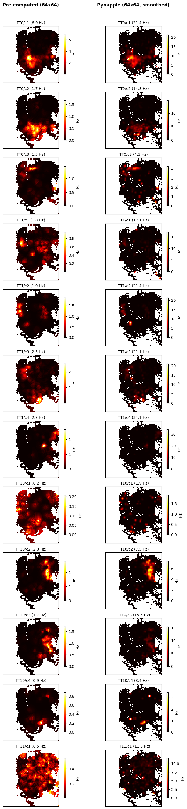

_Source: [NASA Neurolab mission footage](https://youtu.be/2vyJOrlTeEU?si=3aSg7wskDaDDC07s&t=510)_

## Navigating Without Gravity

How does the brain know where you are? In mammals, hippocampal "place cells" fire at specific locations, forming an internal map of the environment. These cells rely on a combination of visual landmarks and self-motion cues, including signals from the vestibular system that sense gravity and head orientation, to maintain a stable spatial code.

But what happens when you remove gravity from the equation?

This was the question behind one of the most unusual neuroscience experiments ever conducted. During the [Neurolab Space Shuttle mission (STS-90)](https://www.nasa.gov/mission/sts-90/) in April 1998, James Knierim, Bruce McNaughton, and Gina Poe recorded ensembles of hippocampal place cells from three freely moving rats in microgravity, the only recordings of navigation-related neurons from freely behaving animals in space.

Their findings, published in [*Nature Neuroscience*](https://doi.org/10.1038/72910), showed that hippocampal neurons can form robust, spatially selective firing fields even in the absence of gravitational cues, but that the process may require more time or experience than under normal terrestrial conditions.

## The Experiment

The rats were implanted with chronic multi-electrode recording arrays targeting hippocampal area CA1. On the shuttle, they navigated two track configurations:

- **The Escher Staircase**, a three-dimensional track with interleaved 90-degree yaw and pitch turns. A rat making three right turns would complete a full circuit and return to its starting position, something that would require four turns on a flat surface. This design put landmark-based spatial information in direct conflict with the internal sense of direction.
- **The Magic Carpet**, a flat, two-dimensional surface for comparison.

The rats pulled themselves along the tracks by grasping the edges, receiving medial forebrain bundle stimulation as a reward. Position was tracked via video camera, and spike data was sorted offline using Xclust.

## Key Findings

Despite the absence of gravity, which renders the otolith organs useless for sensing static head orientation, place cells developed normal spatial firing properties:

- **Spatial information content** (bits per spike) on Flight Day 9 was statistically indistinguishable from preflight recordings for all three rats.
- **Place fields were stable** across repeated sessions on the same track.
- Some cells showed **direction selectivity**, firing preferentially when the rat moved in one direction, a property also seen on Earth.
- **Hippocampal EEG** showed normal theta rhythm during locomotion and normal sharp waves and ripples during rest.

Interestingly, the first exposure to the Escher Staircase on Flight Day 4 produced *abnormal* spatial firing patterns that differed between rats, suggesting that the hippocampus may need either a period of adaptation to microgravity or more experience with a novel environment than is typically required on Earth.

## Now Available on DANDI

Over 25 years after these historic recordings, the data is now publicly available on DANDI as [Dandiset #001754](https://dandiarchive.org/dandiset/001754). The NWB dataset includes:

- **8 NWB files** across 3 rats, covering preflight and in-flight sessions (Flight Days 4 and 9)
- **Spike-sorted unit data** from multi-tetrode recordings in hippocampal CA1
- **Position tracking** for in-flight behavioral sessions
- **Pre-computed rate maps** (64x64 spatial firing rate maps) from the original analysis
- **Behavioral epochs** annotated with task type (Escher Staircase, Magic Carpet, Baseline)

All data is stored in the [Neurodata Without Borders (NWB)](https://www.nwb.org/) format and can be streamed directly from DANDI, no download required. The original source data is archived on the [NASA Open Science Data Repository (OSD-968)](https://osdr.nasa.gov/bio/repo/data/studies/OSD-968), where it was curated by Rachel Gilbert, PhD, and Ryan T. Scott, PhD, of the NASA data curation team.

## Explore the Data Yourself

We've prepared a Jupyter [notebook](https://github.com/dandi/example-notebooks/blob/master/001754/CatalystNeuro/001754_demo.ipynb) that walks through the dataset and reproduces key analyses from the paper. Using [pynapple](https://pynapple.org/) for neural data analysis and [remfile](https://github.com/flatironinstitute/remfile) for streaming access, the notebook demonstrates how to:

- Stream NWB files directly from DANDI
- Visualize animal trajectories on the Escher Staircase, Magic Carpet, and Baseline tracks
- Plot spike rasters across all recorded neurons
- Compute 2D spatial firing rate maps and compare them against the pre-computed maps from the original analysis
- Compare place fields across different track geometries

The notebook confirms that place fields computed from the raw data closely match the pre-computed rate maps from over 25 years ago, a testament to both the quality of the original recordings and the value of standardized data formats for long-term preservation.

_**Reproducing spatial firing rate maps.** Pre-computed rate maps from the original 1998 analysis (left) compared with rate maps computed from the raw spike and position data using pynapple (right). Each row is a single neuron recorded on the Escher Staircase track during Flight Day 9. Despite differences in peak firing rate due to smoothing parameters, the spatial structure of the place fields matches closely across both methods._

## Why This Matters

This dataset is a unique piece of scientific history. While earlier COSMOS/Bion missions recorded vestibular neural activity from restrained monkeys in orbit, the Neurolab recordings remain, to our knowledge, the only cognitive neural data from freely behaving animals in space. The questions they raise are still open: Does the hippocampus develop a true three-dimensional spatial code in microgravity, or does it create independent two-dimensional maps for each surface? What cues drive place cell firing when gravity is absent? How does the vestibular system adapt during extended spaceflight?

By making this data openly available in a modern, standardized format, we hope to enable new analyses that were not possible with the tools of 1998. With renewed interest in long-duration spaceflight and the neuroscience of navigation, these recordings from the Space Shuttle may yet have more to teach us.

## References

Knierim, J. J., McNaughton, B. L. & Poe, G. R. Three-dimensional spatial selectivity of hippocampal neurons during space flight. *Nature Neuroscience* **3**, 209-210 (2000). [doi:10.1038/72910](https://doi.org/10.1038/72910)
